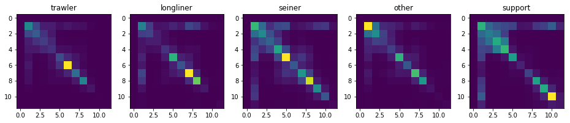

# FishingForFishermen2
My solution of FishingForFishermen2 Marathon Match.

## Information
- [Competition page](https://community.topcoder.com/longcontest/?module=ViewProblemStatement&rd=16978&pm=14691)
- [Final leaderboard](https://community.topcoder.com/longcontest/stats/?module=ViewOverview&rd=16978)
- My Topcoder handle: [amorgun](https://www.topcoder.com/members/amorgun/)

## Solution
### Features used.
#### A. Coordinate features.  

After plotting all track points I noticed that tracks of the same type are commonly grouped together. This observation can be explained by the fact that different techniques of fishing work better in the different fishing areas. In order to obtain useful features, I calculated minimal distances from each point to each track. Then for each point I calculated 5 groups of percentiles of minimal distances to tracks of each class. Finally, I calculated percentiles of these percentiles for all points inside each track and used them as features of the respective track.
##### Possible improvements  
Classifying each point based on its coordinate may be a good idea. Probabilities of point classes can be combined into useful features of tracks. 

#### B. Speed features.  
It is possible to calculate real vessel speed using a list of its coordinates and timestamps. First of all, I used percentiles of these speeds as track features. Secondly, since we have a sequence of speed measurements we can split speed values into a number of bins and calculate probabilities of transitions between each pair of bins.


##### Possible improvements  
The same idea can be applied to the angles between consecutive segments of tracks but I did not manage to find a way to calculate an angle between 3 points on a sphere. 

#### C. Other features.  
For each feature except coordinates and timestamps I calculated percentiles and used it as track features.
### Models used.
- XGBoost trained on features A + B.
- XGBoost trained on features A + B + C.
- LightGBM trained on features A + B.
- LightGBM trained on features A + B + C.
- Multilayer perceptron with one hidden layer with 200 neurons trained on features A + B + C.
- 11-nearest neighbor classifier trained on features A + B + C.
Predictions of all models were averaged for calculating final probabilities.
### Advantages of the chosen approach
- Simplicity
- Low hardware requirements, no GPU is required.
### Disadvantages of the chosen approach
- Bad scaling with increasing the number of vessels due to calculating coordinate features for each track - point pair.

## Usage
1.
```
git clone https://github.com/amorgun/FishingForFishermen2.git
cd FishingForFishermen2
pip install -r requirements.txt
```
2. Put data into `input` folder.
3. Run `run.sh`.
4. The result will be in the file `solution.csv`.
